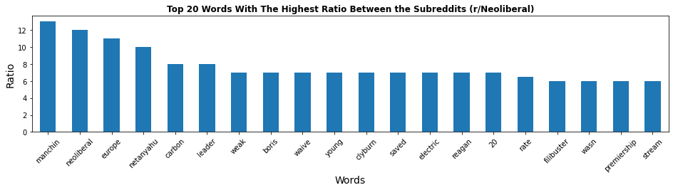
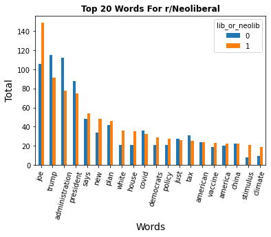
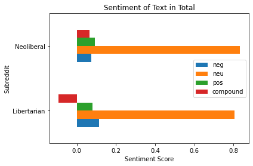
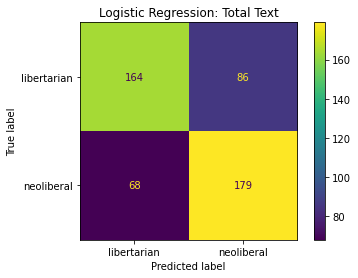

#  Project 3: Web APIs & NLP

## Problem Statement

### How do r/Libertarian and r/Neoliberal differ on Biden post-inaguration?

The goal of the project is to see how these two ideologically similar subreddits perceive Biden and his term as president so far.

Success in this project isn't to necessarily develop a model that accurately predicts consistently, but rather to convey what issues these two ideologies care about and the overall sentiment both subreddits have regarding Biden. Considering a lot of this information will be rather focused on EDA, it's hard to necessarily judge the success of this project on the individual models created, rather the success of this project will be determined primarily in the EDA, Visualization, and Presentation sections of the actual project. With that being said however, I will still use a wide variety of models to determine the predictive value of the data I gathered.

Hypothesis: I believe that the two subreddits will differ significantly on what issues they discuss and their sentiment towards Biden, I think because of these differences a model can be made that can accurately predict which post belongs to who. Primarily, I will be focusing on the differences between these subreddits in sentiment and words used.

## Data Collection

When collecting data, I initially didn't have the problem statement in mind necessarily before I started. When I began data collecting, I knew I wanted to do something political specifically on the Biden admin post innaguration but I really wanted to go through the process experimenting with different subreddits which made for an interesting situation.

I definitely learned a lot more about the API going into the data collection process blind,such as knowing to avoid deleted posts by excluding "[deleted]" from the selftext among other things, especially about using score and created_utc for gathering posts. I would say the most difficult process was just finding subreddits and then subsequently seeing if they have enough posts while trying to construct different problem statements using the viable subreddits.

At the end, I decided on just choosing r/neoliberal and r/libertarian, there might've been easier options for model creation but personally, I found it a lot more interesting especially since I already browse r/neoliberal fairly frequently so I was invested in the analysis.

## Data Cleaning and EDA

When performing data cleaning and EDA, I really did these two tasks in two seperate notebooks. My logistic regression notebook and in my notebook dedicated to EDA and data cleaning. The reason for that being, I initially just had the logistic regression notebook but then wanted to do further analysis on vectorized sets so I created it's own notebook for that while still at times referencing ideal vectorizer parameters I found in my logistic regression notebook.

Truth be told, I did some cleaning in the data gathering notebook, just checking if there were any duplicates or if there were any oddities that I found and I didn't find much, there might have been a few removed posts that snuck in to my analysis but truth be told, it wasn't anything warranting an editing of my data gathering techniques or anything that would stop me from using the data I already gathered.

EDA primarily was just trying to find words that stuck out using count vectorizers, luckily, that was fairly easy to do considering the NLP process came fairly naturally to me. I used lemmatizers for model creation but I rarely used it for my actual EDA, I primarily just used a basic tokenizer without any added features. The bulk of my presentation directly comes from this and domain knowledge where I can create conclusions from the information gathered from this EDA process. EDA helped present a narrative that I was able to fully formulate with my domain knowledge which then resulted in the conclusions found in my presentation.

Another part of EDA that was critical, was the usage of sentiment analysis to find the difference in overall tone between the two subreddits on Biden, this was especially important in my analysis as it also ended up being apart of my preprocessing as well. Sentiment analysis was used in my presentation to present the differences in tone towards Biden but also emphasize the amount of neturality in the posts themselves, this is due primarily to the posts being titles of politically neutral news titles or tweets. 

 

## Preprocessing and Modelling

Modelling was a very tenuous process and Preprocessing as well because a lot of it was very memory intensive which resulted in a lot of time spent baby-sitting my laptop but ultimately it provided a lot of valuable information not only on the data I was investigating but also on the models I was using. I used bagging classifiers, logistic regression models, decision trees, random forest models, and boosted models. All of these I had to very mixed success but logistic regression was the one I had the most consistency with, especially with self text exclusive posts. Random forest, decision trees, and boosted models, I all had high expectations for but was not as consistently effective as the logistic regression models. Due to general model underperformance, I will be primarily talking about the logistic regression models I created in the logreg notebook as I had dedicated the most time finetuning those models and had generally more consistent performance with those models than I did others.

I specifically had massive troubles with predicting neoliberal posts while Libertarian posts, I generally managed a decent rate at. My specificity was a lot better than my sensitivity. When I judged my model's ability to predict, I looked at self-text, title-exclusive, and total text. This allowed me to individually look at what each model was good at predicting and also what data to gather the next time I interact with this API.

My preprocessing was very meticulous, specifically experimenting with different vectorizer parameters when using my logistic regression model. Adjustment of parameters and the addition of sentiment scores to try and help the model's performance. Adjusting the vectorizer parameters such as binary and others were heavily tweaked depending on the X variable used (selftext, title, totaltext).

## Conclusion

When analyzing this data, it is clear that there are three key takeaways from my modeling process and EDA stage.

1. The overwhelming neutrality in the text (specifically the title) itself, can hide the true opinions of those in the subreddit.

2. Predictive models are incredibly difficult to perform on these subreddits in particular and potentially other political subreddits.

3. The issues in which the subreddits most differ on, is primarily due to r/Libertarian focusing more on surveillance and misinformation in the media while r/Neoliberal is concerned with global politics, climate, and sitting senate representatives.

4. They both discuss tax, covid, stimulus, china and other current topics relatively often

## Sources Used

[Britannica Definition of Libertarianism](https://www.britannica.com/topic/libertarianism-politics)

[Neoliberal Project](https://neoliberalproject.org/)

[Stanford Philosophy: Libertarianism](https://plato.stanford.edu/entries/libertarianism/)

[Stanford Philosophy: Neoliberalism](https://plato.stanford.edu/entries/neoliberalism/#Summ)

[Neoliberal Podcast: Defining Neoliberalism](https://open.spotify.com/episode/5VNGbGeyBtgJDYq2uDbXnw?si=h-Xuyuw-Q02ODyABBXNNWQ)

[r/Libertarian](www.reddit.com/r/libertarian)

[r/neoliberal](www.reddit.com/r/neoliberal)
